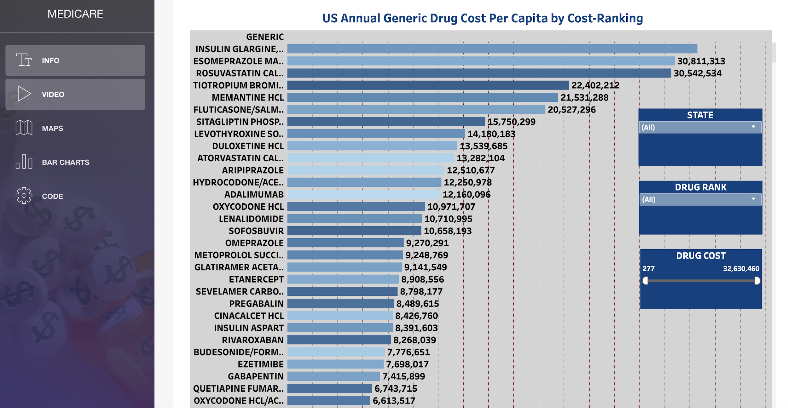
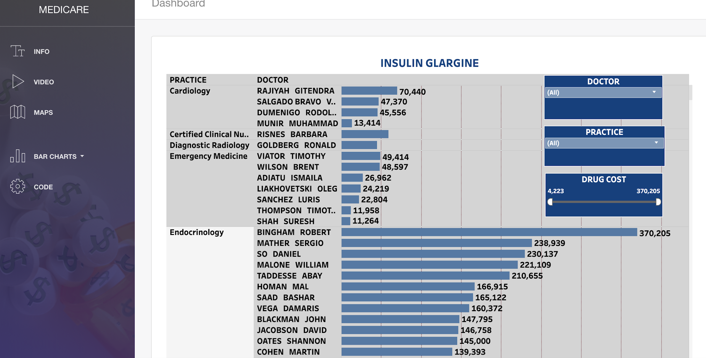
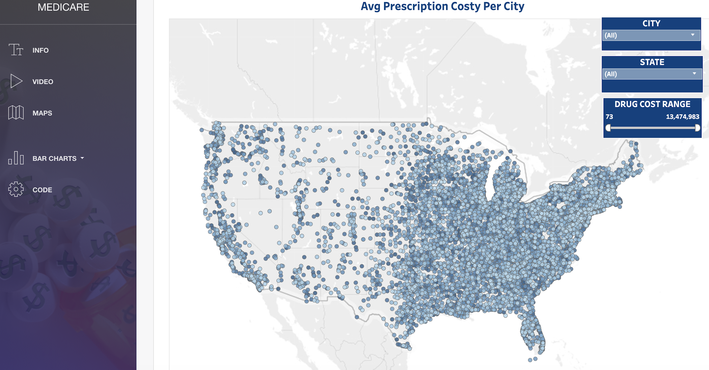
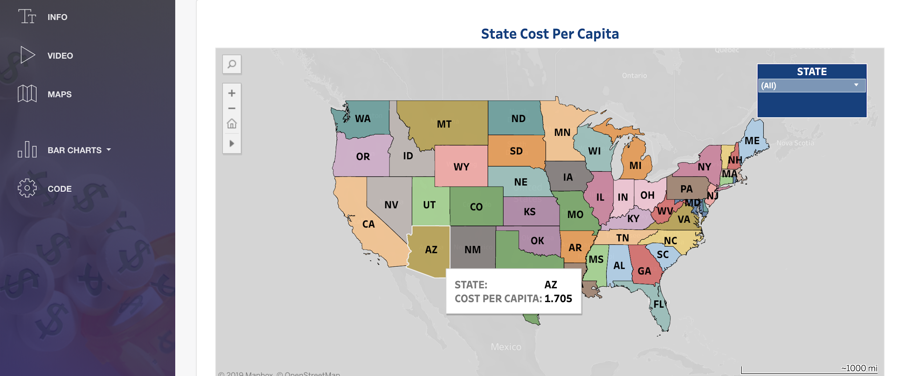

**Healthcare Cost Driver**

Mason Waters

 

<table>
  <tr>
    <td>Project Purpose</td>
    <td>This project aims to target the over prescription of drugs which is a leading cost driver in US healthcare. Prescription-Drugs is one of the leading interventions in medical practice. We will analyze data on the cost per capita by State and Region, and average cost by city. We will also identify the top 5 prescribed drugs in the US, the prescribing physicians, the physicians’ medical practice. 

Medicare is the federal health insurance program created in 1965 for people ages 65 and over, regardless of income, medical history, or health status. The program was expanded in 1972 to cover certain people under age 65 who have a long-term disability. Today, Medicare plays a key role in providing health and financial security to 60 million older people and younger people with disabilities. The program helps to pay for many medical care services, including hospitalizations, physician visits, prescription drugs, preventive services, skilled nursing facility and home health care, and hospice care. In 2017, Medicare spending accounted for 15 percent of total federal spending and 20 percent of total national health spending.
Most people ages 65 and over are entitled to Medicare Part A if they or their spouse are eligible for Social Security payments, and do not have to pay a premium for Part A if they paid payroll taxes for 10 or more years. People under age 65 who receive Social Security Disability Insurance (SSDI) payments generally become eligible for Medicare after a two-year waiting period, while those diagnosed with end-stage renal disease (ESRD) and amyotrophic lateral sclerosis (ALS) become eligible for Medicare with no waiting period.

What is the total number of medications prescribed in each state? 
CMS_MEDICARE
Part_d_prescriber_2014 (drug_name, generic_name,nppes_provider_state)
MEDICARE
Part_d_prescriber_2014 (drug_name, generic_name, nppes_provider_state)
What is the most prescribed medication in each state?
CMS_MEDICARE
Part_d_prescriber_2014( total_drug_cost, nppes_provider_state)
MEDICARE
part_d_prescriber_2014(generic_name, drug_name)
What is the average cost for inpatient and outpatient treatment in each city and state?
CMS_MEDICARE
inpatient_charges_2014(provider_city, provider_state, average_covered_charges )
outpatient_charges_2014
Which are the most common inpatient diagnostic conditions in the United States?
CMS_MEDICARE
inpatient_charges_2014 (drg_definition)

What are the average payments for these conditions in these cities and how do they compare to the national average?
part_d_prescriber_2014(generic_name, drug_name)
</td>
  </tr>
  <tr>
    <td>The Need for this Project</td>
    <td>The cost of treating each individual Medicare beneficiary has been growing faster than our gross domestic product, or GDP.  That cannot continue indefinitely.  But the problem is compounded because the Medicare beneficiary population is growing faster than the population at large, and is likely to continue to do so indefinitely – and at a rapid rate for the next quarter century or so.  In sum (or perhaps "in product," because the two unsustainable rates of growth are in effect multiplied by each other), the math simply doesn’t work.
Physician or provider profiling is an attempt to measure the performance of doctors and providers of health care by supplying interested parties with information on the structure, process, and outcomes of health care.4 Its rationale is that analysing patterns of care will help to reduce the variation in performance among doctors and lead to improvements in the quality of health care.5 Two main types of profiling are used in the United States. Clinical profiling examines doctors' styles of practice by looking at the types of treatment and services that they use and the outcomes of care. Economic profiling examines the financial aspects of a doctor's practice. Researchers in the United States have now developed many sophisticated tools for profiling physicians (see bmj.com).
Ideally, profiling should provide doctors with meaningful information on their clinical performance to help improve the quality of the services they provide. However, purchasers have largely developed physician profiling as a tool to control costs and ensure they are getting value for money, rather than as a method of measuring and improving the quality of care. Profiling has also been used for other purposes, including providing information to consumers to help in their selection of physician and healthcare plan (box ​
</td>
  </tr>
  <tr>
    <td>Evidence</td>
    <td>Cost Driver: 
Poorly coordinated, inefficient care delivery

Inefficient Care Delivery Inefficient care delivery is another key driver of U.S. underperformance on health care costs and quality. The U.S. may not be an outlier compared to other countries in rates of utilization of most services, but a significant proportion of U.S. health spending remains attributable to inefficient delivery of health care services. 36 Direct Public Subsidies for Waste Waste and inefficient health care delivery has been attributed to the United States’ reliance on fee-for-service provider reimbursement across payers both public and private. 37 FFS reimbursement does have value in certain circumstances. It can serve to expand the quantity of services or goods furnished to patients. Nonetheless, there is a point where further increasing the volume of services or drugs for any individual is not the optimal treatment. At this point, FFS’ incentives for ever-increasing volume generate additional costs to families, employers and taxpayers, with sub-optimal or no benefit to patients. In fact, FFS can actually harm patients as a result of over-prescription of drugs, unnecessary tests, or avoidable hospitalizations. In this way, FFS actively drives waste in the health care system in the United States.
</td>
  </tr>
</table>

 		 

